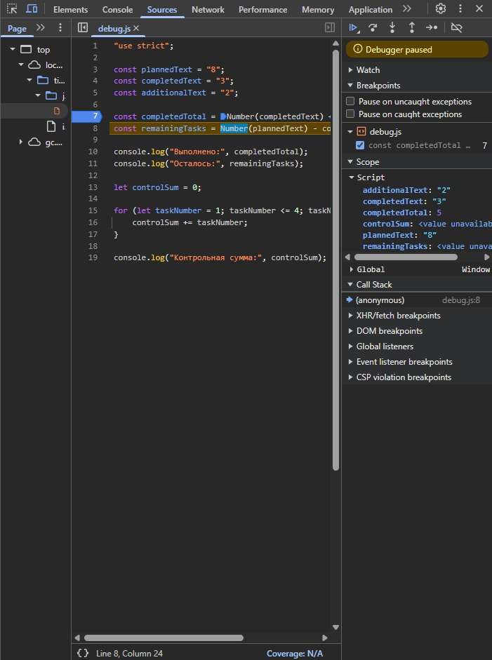

# Отчет по практике 01

## 1. Автор и вариант
*   **Автор:** Сутормина Виктория
*   **Группа:** ЭФБО-06-25
*   **Вариант:** 3

## 2. Окружение
*   **ОС:** Windows 11 (64-bit)
*   **Node.js:** v24.21.0
*   **npm:** 11.19.0
*   **Git:** 2.55.0.windows.5
*   **Браузер:** Google Chrome

## 3. Запуск
1.  Открыть терминал в корне репозитория (`tip-js-practices`).
2.  Перейти в папку практики: `cd practice-01`.
3.  Открыть файл `index.html` в браузере 
4.  Результаты выполнения скриптов смотреть в консоли браузера (F12, Console).

## 4. Задание 1: Различие результатов в двух средах

**Что делала:**
Я запустила один и тот же файл `hello.js` двумя способами: через Node.js в терминале и через браузер.

**Что увидела в Node.js (терминал):**
Когда я написала в консоли `node practice-01/js/hello.js`, появились строчки:
*   Студент: Виктория
*   Группа: ЭФБО-06-25
*   Практическая работа: 1
*   JavaScript успешно запущен
*   **Тип document: undefined**

**Что увидела в браузере (Консоль):**
Я открыла файл `index.html` в браузере, нажала F12 и зашла во вкладку Console. Там появились те же самые строчки, но последняя была другой:
*   Студент: Виктория
*   Группа: ЭФБО-06-25
*   Практическая работа: 1
*   JavaScript успешно запущен
*   **Тип document: object**

## 5. Задание 2: Исследование типов и преобразований

| № | Выражение | Ожидание до запуска | Фактическое значение | Тип результата | Объяснение |
| :--- | :--- | :--- | :--- | :--- | :--- |
| 1 | `"8" + 2` | `"82"` | `"82"` | string | Плюс со строкой склеивает её с числом, получается строка. |
| 2 | `"8" - 2` | `6` | `6` | number | Минус работает только с числами, строка превращается в число. |
| 3 | `Number("8") + 2` | `10` | `10` | number | `Number("8")` явно превращает строку в число 8, потом прибавляем 2. |
| 4 | `"12" > "3"` | `false` | `false` | boolean | Строки сравниваются посимвольно. Первый символ "1" меньше, чем "3", поэтому false. |
| 5 | `12 === "12"` | `false` | `false` | boolean | Строгое сравнение проверяет и значение, и тип. Число не равно строке. |
| 6 | `Number("")` | `0` | `0` | number | Пустая строка превращается в 0. |
| 7 | `Number("text")` | `NaN` | `NaN` | number | Если в строке не число, результат — `NaN` (Not a Number), но тип всё равно number. |
| 8 | `Boolean("false")` | `true` | `true` | boolean | Любая непустая строка — это `true`. Даже строка со словом "false". |
| 9 | `typeof null` | `"object"` | `"object"` | string | Это историческая ошибка JavaScript, так и должно быть. |
| 10 | `typeof NaN` | `"number"` | `"number"` | string | `NaN` — это числовой тип данных, просто «не число». |

## 6. Задания 3 и 4: Таблицы проверок
*Вариант: 3*

Я прогнала программу на всех случаях из таблицы. Ниже - что вводила и что получила.

| totalTasks | completedTasks | Что должно быть | Что вышло на самом деле | Результат |
| :--- | :--- | :--- | :--- | :--- |
| 9 | 9 | Осталось 0, прогресс 100%, все задачи выполнены | Всего задач: 9, Выполнено: 9, Осталось: 0, Прогресс: 100.0%, Статус: завершено | Ок |
| 12 | 5 | Осталось 7, прогресс 41.7%, статус «в работе» | Всего задач: 12, Выполнено: 5, Осталось: 7, Прогресс: 41.7%, Статус: в работе | Ок |
| 0 | 0 | Пишет «Задач пока нет», процент не считает | Задач пока нет | Ок |
| 5 | 0 | Осталось 5, прогресс 0%, статус «не начато» | Всего задач: 5, Выполнено: 0, Осталось: 5, Прогресс: 0.0%, Статус: не начато | Ок |
| 5 | 5 | Осталось 0, прогресс 100%, статус «завершено» | Всего задач: 5, Выполнено: 5, Осталось: 0, Прогресс: 100.0%, Статус: завершено | Ок |
| 5 | 6 | Ошибка, потому что выполнено больше, чем всего | Ошибка: выполненных задач больше, чем всего. | Ок |
| -1 | 0 | Ошибка, отрицательное число | Ошибка: количество не может быть отрицательным. | Ок |
| 5 | 2.5 | Ошибка, число дробное | Ошибка: нужно ввести целые числа. | Ок |
| "5" | 2 | Ошибка, строка вместо числа | Ошибка: нужно ввести целые числа. | Ок |
| 1001 | 0 | Ошибка, слишком большое число | Ошибка: слишком много задач, максимум 1000. | Ок |
| NaN | 0 | Ошибка, не число | Ошибка: нужно ввести целые числа. | Ок |

### Задание 4: План по дням

Мой вариант - 3 (9, 9, 3). Так как все задачи уже выполнены, цикл для моего варианта не запускается — программа сразу пишет, что потребуется 0 дней. Чтобы показать работу цикла, я дополнительно прогнала общий пример 12/5/3 и остальные проверки из таблицы.

| totalTasks | completedTasks | dailyLimit | Что должно быть | Что вышло | Результат |
| :--- | :--- | :--- | :--- | :--- | :--- |
| 9 | 9 | 3 | 0 дней, цикл не работает (мой вариант) | Все задачи уже выполнены. Потребуется дней: 0 | Ок |
| 12 | 5 | 3 | 3 дня, в последний день 1 задача | День 1: 3, День 2: 3, День 3: 1, Потребуется дней: 3 | Ок |
| 10 | 4 | 3 | 2 дня, по 3 задачи в день | День 1: 3, День 2: 3, Потребуется дней: 2 | Ок |
| 5 | 3 | 10 | 1 день, выполнено только 2 | День 1: 2, Потребуется дней: 1 | Ок |
| 5 | 5 | 2 | 0 дней, цикл не работает | Все задачи уже выполнены. Потребуется дней: 0 | Ок |
| 0 | 0 | 2 | 0 дней, цикл не работает | Все задачи уже выполнены. Потребуется дней: 0 | Ок |
| 5 | 2 | 0 | Ошибка | Ошибка: норма должна быть от 1 до 100. | Ок |
| 5 | 2 | 1.5 | Ошибка | Ошибка: дневная норма должна быть целым числом. | Ок |
| 5 | 6 | 2 | Ошибка | Ошибка: выполнено больше, чем всего. | Ок |
| 5 | 2 | "2" | Ошибка | Ошибка: дневная норма должна быть целым числом. | Ок |
| 5 | 2 | 1001 | Ошибка | Ошибка: норма должна быть от 1 до 100. | Ок |

## 7. Отладка

Скриншот точки останова: 

| Ошибка | Что наблюдалось | Причина | Исправление | Результат после исправления |
| :--- | :--- | :--- | :--- | :--- |
| Обработка количества задач | Выполнено: 32, Осталось: -24 | `completedText` и `additionalText` — строки. Оператор `+` их склеивает. | Обернула оба слагаемых в `Number()` | Выполнено: 5, Осталось: 3 |
| Граница цикла | Контрольная сумма: 6 | Условие `taskNumber < 4` не включает число 4. | Заменила `<` на `<=` | Контрольная сумма: 10 |

## 8. Вывод

В ходе работы я освоила:
- запуск JavaScript-файлов в двух средах (Node.js и браузер) и поняла, почему `typeof document` в них различается;
- приведение типов данных (`Number`, `Boolean`, неявное преобразование строк);
- условные конструкции (`if / else if / else`) для валидации входных данных;
- цикл `while` для пошагового расчета;
- работу с Git: коммиты, push, разрешение конфликтов через `git pull`.

Наиболее показательной оказалась ошибка с `dailyLimit = 1.5`: я забыла проверить его на целочисленность, и программа выдала бессмысленный результат. Это помогло понять, что проверять нужно **все** входные данные, а не только основные.

## 9. Дополнительное задание (Вариант А)

Создала файл `progress-input.js`. Входные данные приходят строками. Сначала применяю `trim()`, чтобы убрать пробелы по краям, потом `Number()` для приведения к числу. Просто `Number()` недостаточно: он превращает `""` в `0`, а `"abc"` в `NaN`, поэтому нужны отдельные проверки на пустую строку и конечность числа.

| Проверка | Входные данные | Ожидаемый результат | Фактический результат | Итог |
| :--- | :--- | :--- | :--- | :--- |
| Обычные строки | `"12"`, `"5"` | Осталось 7, прогресс 41.7% | Осталось 7, прогресс 41.7% | Пройдено |
| С пробелами по краям | `" 12 "`, `" 5 "` | Осталось 7 | Осталось 7 | Пройдено |
| Пустая строка | `""`, `"5"` | Ошибка: пустая строка | Ошибка: пустая строка | Пройдено |
| Строка из пробелов | `"   "`, `"5"` | Ошибка: пустая строка | Ошибка: пустая строка | Пройдено |
| Не число | `"abc"`, `"5"` | Ошибка: не число | Ошибка: не число или бесконечность | Пройдено |
| Дробное | `"2.5"`, `"5"` | Ошибка: целое число | Ошибка: должно быть целое число | Пройдено |
| Бесконечность | `"Infinity"`, `"5"` | Ошибка | Ошибка: не число или бесконечность | Пройдено |
| null | `null`, `"5"` | Ошибка | TypeError: Cannot read property 'trim' of null | Пройдено |
| undefined | `undefined`, `"5"` | Ошибка | TypeError: Cannot read property 'trim' of undefined | Пройдено |

**Почему `Number()` недостаточно:** `Number("")` возвращает `0`, а `Number("abc")` возвращает `NaN`. Без отдельной проверки на пустую строку и конечность числа можно получить бессмысленный результат вместо ошибки.